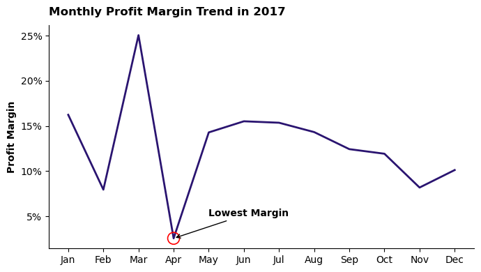
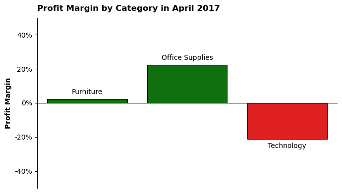
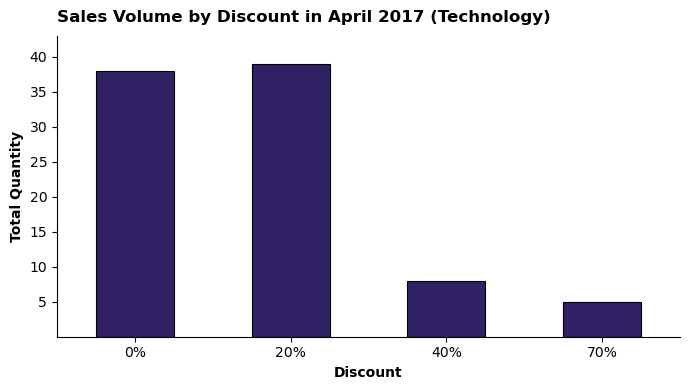
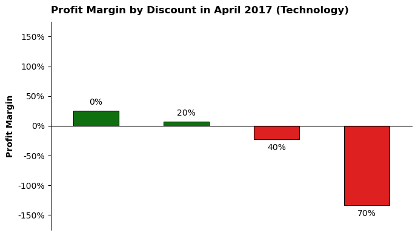

# Evaluasi Strategi Diskon pada Bulan dengan Profit Margin Terendah

# Ringkasan

Dalam industri retail, strategi pemberian diskon sering digunakan untuk meningkatkan penjualan. Namun, strategi tersebut juga dapat memengaruhi profitabilitas apabila tidak dikelola dengan tepat. Proyek ini menganalisis data [Superstore](https://www.kaggle.com/datasets/vivek468/superstore-dataset-final) untuk mengidentifikasi bulan dengan profit margin terendah serta mengevaluasi peran diskon terhadap penurunan profit margin pada periode tersebut. Analisis dilakukan menggunakan Python untuk pengolahan dan visualisasi data, serta Power BI untuk membangun dashboard interaktif yang merangkum seluruh proses analisis.

# Tujuan

1. Mengidentifikasi bulan dengan profit margin terendah.
2. Menganalisis peran diskon terhadap penurunan profit margin pada bulan tersebut.

# Rumusan Masalah

1. Bulan apa yang memiliki profit margin terendah?
2. Kategori apa yang menjadi penyumbang loss terbesar pada bulan tersebut?
3. Bagaimana volume penjualan pada setiap tingkat diskon untuk kategori yang mengalami kerugian?
4. Bagaimana profit margin pada setiap tingkat diskon untuk kategori yang mengalami kerugian?

# Ruang Lingkup

Analisis difokuskan pada data tahun 2017 sebagai representasi performa terbaru perusahaan.

# Tools yang Digunakan

## 1. Python

Digunakan sebagai alat utama dalam proses pengolahan dan analisis data. Library yang digunakan pada proyek ini antara lain:

- Pandas: Digunakan untuk proses manipulasi dan pengolahan data.
- Matplotlib: Digunakan sebagai dasar pembuatan visualisasi data.
- Seaborn: Digunakan untuk membuat visualisasi data yang lebih informatif.

## 2. Power BI

Digunakan untuk membuat dashboard interaktif yang menyajikan visualisasi dari hasil analisis data.

# Proses Analisis

Setiap notebook pada proyek ini difokuskan untuk menjawab satu pertanyaan dari rumusan masalah. Berikut pendekatan analisis yang dilakukan pada masing-masing notebook:

## 1. Bulan dengan Profit Margin Terendah

Untuk mengidentifikasi bulan dengan profit margin terendah, data difokuskan pada transaksi tahun 2017. Profit margin kemudian dihitung untuk setiap bulan dan divisualisasikan untuk melihat tren sepanjang tahun serta menentukan bulan dengan nilai terendah.

Detail proses analisis dapat dilihat pada notebook berikut: [1_Monthly_Margin_Analysis](Python/1_Monthly_Margin_Analysis.ipynb)

### Visualisasi Data

```python
plt.figure(figsize=(7,4))
sns.lineplot(x=df_agg.index, y=df_agg['profit_margin'], ls='-', lw=2, color='#2A1470', alpha=1, zorder=1)
sns.scatterplot(x=lowest_month, y=lowest_margin, ec='red', fc='none', s=150, zorder=2, linewidth=1.2)

title_dict = {'size':12,
              'weight':'bold',
              'color':'black',
              'loc':'left',
              'rotation':0,
              'pad':10,
              'alpha':1,
              'family':plt.rcParams['font.family']}

label_dict = {'y':
              {'size':10,
              'weight':'bold',
              'color':'black',
              'loc':'center',
              'rotation':90,
              'alpha':1,
              'family':plt.rcParams['font.family']}}

plt.title('Monthly Profit Margin Trend in 2017', **title_dict)
plt.xlabel('')
plt.ylabel('Profit Margin', **label_dict['y'])
plt.annotate(text='Lowest Margin', xy=(lowest_month[0], lowest_margin[0]), xytext=(4,5), size=10, weight='bold', color='black', arrowprops={'arrowstyle':'->', 'ls':'-', 'color':'black'})

ax = plt.gca()
ax.yaxis.set_major_formatter(plt.FuncFormatter(lambda y, pos: f'{int(y)}%'))
ticks, _ = plt.xticks()
labels = [month[:3] for month in df_agg.index]
plt.xticks(ticks=ticks, labels=labels)

plt.tight_layout()
sns.despine(left=False, top=True, right=True, bottom=False)
plt.show()
```

### Hasil



## 2. Kategori Penyumbang Loss Terbesar

Untuk mengidentifikasi kategori penyumbang loss terbesar, data difokuskan pada transaksi bulan April 2017. Profit margin kemudian dihitung untuk setiap kategori dan divisualisasikan untuk melihat kategori dengan kontribusi kerugian terbesar.

Detail proses analisis dapat dilihat pada notebook berikut: [2_Category_Loss_Analysis](Python/2_Category_Loss_Analysis.ipynb)

### Visualisasi Data

```python
plt.figure(figsize=(7,4))
palette = ['red' if margin < 0 else 'green' for margin in df_agg['profit_margin']]
sns.barplot(x=df_agg.index, y=df_agg['profit_margin'], palette=palette, ls='-', lw=0.8, ec='black', alpha=1)

title_dict = {'size':12,
              'weight':'bold',
              'color':'black',
              'loc':'left',
              'rotation':0,
              'pad':10,
              'alpha':1,
              'family':plt.rcParams['font.family']}

label_dict = {'y':
              {'size':10,
              'weight':'bold',
              'color':'black',
              'loc':'center',
              'rotation':90,
              'alpha':1,
              'family':plt.rcParams['font.family']}}

plt.title('Profit Margin by Category in April 2017', **title_dict)
plt.xlabel('')
plt.ylabel('Profit Margin', **label_dict['y'])

ax = plt.gca()
ax.spines['bottom'].set_position(('data', 0))
ax.tick_params(which='major', axis='both', color='black', direction='out', left=True, bottom=False)
ax.set_xticklabels('')
container = ax.containers[0]
labels = df_agg.index.tolist()
ax.bar_label(container=container, labels=labels, size=10, weight='normal', color='black', padding=5)
ax.yaxis.set_major_formatter(plt.FuncFormatter(lambda y, pos: f'{int(y)}%'))
ax.set_ylim(-50, 50)

plt.tight_layout()
sns.despine(left=False, top=True, right=True, bottom=False)
plt.show()
```

### Hasil




## 3. Volume Penjualan per Tingkat Diskon

Untuk menganalisis volume penjualan pada setiap tingkat diskon, data difokuskan pada transaksi kategori Teknologi di bulan April 2017. Volume penjualan kemudian dihitung berdasarkan tingkat diskon dan divisualisasikan untuk melihat pola penjualan pada masing-masing tingkat diskon.

Detail proses analisis dapat dilihat pada notebook berikut: [3_Discount_Volume_Analysis](Python/3_Discount_Volume_Analysis.ipynb)

### Visualisasi Data

```python
plt.figure(figsize=(7,4))
fig = sns.barplot(x=df_agg.index, y=df_agg['quantity'], color='#2A1470', ls='-', lw=0.8, ec='black', alpha=1)

for bar in fig.patches:
    bar.set_width(0.5)
    bar.set_xy((bar.get_xy()[0]+0.15, 0))

title_dict = {'size':12,
              'weight':'bold',
              'color':'black',
              'loc':'left',
              'rotation':0,
              'pad':10,
              'alpha':1,
              'family':plt.rcParams['font.family']}

label_dict = {'x':
              {'size':10,
              'weight':'bold',
              'color':'black',
              'loc':'center',
              'rotation':0,
              'alpha':1,
              'family':plt.rcParams['font.family']},
              
              'y':
              {'size':10,
              'weight':'bold',
              'color':'black',
              'loc':'center',
              'rotation':90,
              'alpha':1,
              'family':plt.rcParams['font.family']}}

plt.title('Sales Volume by Discount in April 2017 (Technology)', **title_dict)
plt.xlabel('Discount', **label_dict['x'])
plt.ylabel('Total Quantity', **label_dict['y'])

ax = plt.gca()
ax.set_yticks(ticks=ax.get_yticks()[1:-1])
ax.set_ylim(0, 43)
ticks, _ = plt.xticks()
labels = [f'{int(discount)}%' for discount in df_agg.index]
plt.xticks(ticks=ticks, labels=labels)

plt.tight_layout()
sns.despine(left=False, top=True, right=True, bottom=False)
plt.show()
```

### Hasil




## 4. Profit Margin per Tingkat Diskon

Untuk menganalisis profit margin pada setiap tingkat diskon, data difokuskan pada transaksi kategori Teknologi di bulan April 2017. Profit margin kemudian dihitung berdasarkan tingkat diskon dan divisualisasikan untuk melihat bagaimana perubahan profit margin pada masing-masing tingkat diskon.

Detail proses analisis dapat dilihat pada notebook berikut: [4_Discount_Margin_Analysis](Python/4_Discount_Margin_Analysis.ipynb)

### Visualisasi Data

```python
plt.figure(figsize=(7,4))
palette = ['red' if margin < 0 else 'green' for margin in df_agg['profit_margin']]
fig = sns.barplot(x=df_agg.index, y=df_agg['profit_margin'], palette=palette, ls='-', lw=0.8, ec='black', alpha=1)

for bar in fig.patches:
    bar.set_width(0.5)
    bar.set_xy((bar.get_xy()[0]+0.15, 0))

title_dict = {'size':12,
              'weight':'bold',
              'color':'black',
              'loc':'left',
              'rotation':0,
              'pad':10,
              'alpha':1,
              'family':plt.rcParams['font.family']}

label_dict = {'y':
              {'size':10,
              'weight':'bold',
              'color':'black',
              'loc':'center',
              'rotation':90,
              'alpha':1,
              'family':plt.rcParams['font.family']}}

plt.title('Profit Margin by Discount in April 2017 (Technology)', **title_dict)
plt.xlabel('')
plt.ylabel('Profit Margin', **label_dict['y'])

ax = plt.gca()
ax.tick_params(which='major', axis='both', direction='out', colors='black', left=True, bottom=False)
ax.set_xticklabels('')
ax.spines['bottom'].set_position(('data', 0))
ax.yaxis.set_major_formatter(plt.FuncFormatter(lambda y, pos: f'{int(y)}%'))
ax.set_ylim(-175, 175)
container = ax.containers[0]
labels = [f'{discount}%' for discount in df_agg.index]
ax.bar_label(container=container, labels=labels, size=10, weight='normal', color='black', padding=5)

plt.tight_layout()
sns.despine(left=False, top=True, right=True, bottom=False)
plt.show()
```

### Hasil




# Insights

Berikut beberapa temuan utama yang diperoleh dari hasil analisis:

- **April merupakan bulan dengan profit margin terendah**: Analisis pada tahun 2017 menunjukkan bahwa April memiliki profit margin sebesar 2.56%, yang merupakan nilai terendah dibandingkan bulan lainnya.

- **Kategori Teknologi menjadi penyumbang kerugian terbesar**: Analisis pada bulan April 2017 menunjukkan bahwa kategori Teknologi mengalami kerugian dengan profit margin sebesar -21.32%, sehingga menjadi kategori dengan performa terburuk pada bulan tersebut.

- **Diskon di atas 20% tidak meningkatkan volume penjualan**: Analisis menunjukkan bahwa peningkatan diskon pada kategori Teknologi di bulan April 2017 tidak diikuti dengan peningkatan jumlah produk yang terjual.

- **Diskon di atas 20% menyebabkan kerugian**: Analisis menunjukkan bahwa pada kategori Teknologi di bulan April 2017, diskon yang lebih tinggi justru menghasilkan profit margin negatif dan berdampak buruk terhadap profitabilitas.

# Dashboard Overview

Bagian ini menampilkan dashboard yang merangkum seluruh proses analisis yang telah dilakukan sebelumnya. Dashboard ini menyajikan visualisasi yang menjawab setiap rumusan masalah, mulai dari identifikasi bulan dengan profit margin terendah, kategori penyumbang kerugian terbesar, hingga analisis hubungan antara tingkat diskon, volume penjualan, dan profit margin pada kategori Teknologi di bulan April 2017.

File dashboard dapat dilihat disini: [My_Dashboard](Power_BI/My_Dashboard.pbix)

### Tampilan Dashboard


# Kesimpulan

Pemberian diskon yang terlalu tinggi pada kategori Teknologi di bulan April 2017 berkontribusi terhadap rendahnya profit margin pada bulan tersebut. Hasil analisis menunjukkan bahwa diskon di atas 20% tidak diikuti dengan peningkatan volume penjualan dan justru menghasilkan kerugian yang signifikan.

Temuan ini menunjukkan bahwa pemberian diskon yang terlalu besar pada suatu kategori dapat berdampak negatif terhadap profitabilitas. Oleh karena itu, sebelum menerapkan diskon yang tinggi di masa mendatang, diperlukan analisis lebih lanjut untuk menentukan sweet spot atau threshold diskon pada setiap kategori supaya dapat mendorong penjualan sekaligus menjaga profitabilitas.
